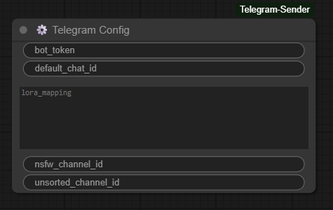
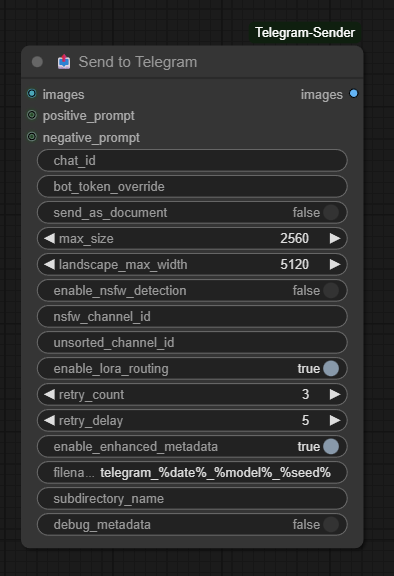

# ComfyUI Telegram Sender 📤

A custom node for ComfyUI that automatically sends generated images to Telegram channels or chats. 

## ✨ Features

- 🔐 **Secure token storage** - token is saved in config file, not in workflow
- 📝 **Automatic metadata extraction** - generation parameters from workflow (seed, steps, CFG, model, LoRA)
- 🖼️ Automatic image resizing
- 🗜️ Compression of large files to comply with Telegram limits
- 📄 Support for sending originals as documents (without compression)
- 🔞 NSFW detection by keyword in prompt
- 🔄 Asynchronous sending (doesn't block workflow)
- 🔁 Automatic retries on errors
- 💾 Saving prompt to PNG metadata in A1111 format
- 📦 Optional channel for unsorted images
- 🌐 Compatibility with Civitai and other metadata recognition services

## 📥 Installation

### Method 1: Via ComfyUI Manager (recommended)

1. Open ComfyUI Manager
2. Click "Install Custom Nodes"
3. Find "ComfyUI-Telegram-Sender"
4. Click Install
5. Restart ComfyUI

### Method 2: Manual installation

1. Open terminal in the `ComfyUI/custom_nodes` folder
```bash
cd ComfyUI/custom_nodes
```

2. Clone the repository:
```bash
git clone https://github.com/Sergey004/ComfyUI-Telegram-Sender
```

3. Install dependencies:
```bash
pip install requests pillow
```

4. Restart ComfyUI

## 🤖 Telegram Bot Setup

### Step 1: Creating a bot

1. Find [@BotFather](https://t.me/botfather) in Telegram
2. Send the command `/newbot`
3. Enter a name for your bot (for example, "My ComfyUI Bot")
4. Enter a username for the bot (must end with "bot", for example, "mycomfyui_bot")
5. Copy the received token (looks something like this: `123456789:ABCdefGHIjklMNOpqrsTUVwxyz`)

### Step 2: Getting Chat ID

#### For personal chat with the bot:
1. Start a dialog with your bot
2. Send any message
3. Open in browser:
   ```
   https://api.telegram.org/bot<YOUR_BOT_TOKEN>/getUpdates
   ```
4. Find `"chat":{"id":` — this is your Chat ID (for example, `123456789`)

#### For a channel:
1. Create a channel or open an existing one
2. Add the bot to the channel as an administrator
3. Send any message in the channel
4. Open in browser:
   ```
   https://api.telegram.org/bot<YOUR_BOT_TOKEN>/getUpdates
   ```
5. Find `"chat":{"id":` — for channels ID starts with `-100` (for example, `-1001234567890`)

### Step 3: (Optional) Setting up automatic LoRA routing

If you want to automatically send images to different channels based on used LoRA:

1. In the **TelegramConfig** node, fill in the **lora_mapping** field
2. Format: one line = one rule `lora_name:chat_id`

Example:
```
anime:-1001111111111
realistic:-1002222222222
fantasy:-1003333333333
```


Now:
- If LoRA with "anime" in the name is used in workflow → sends to channel `-1001111111111`
- If LoRA with "realistic" in the name is used → sends to channel `-1002222222222`
- And so on.

**Note:** Mapping works by partial match. If LoRA name contains the keyword (for example, `anime_style_v2.safetensors` contains `anime`), the rule will trigger.

## 🎨 Usage

### Initial setup (one time)

#### Method 1: Using ComfyUI Settings (Recommended) ⭐

1. Open ComfyUI settings menu (gear icon in bottom left)
2. Find the **"Telegram Sender"** section
3. Enter your **bot_token** (received from @BotFather)
4. Enter **default_chat_id** (optional, can be specified in each node separately)
5. (Optional) Configure **LoRA to Channel Mapping** - one line per rule: `lora_name:chat_id`
6. (Optional) Configure **NSFW Channel ID** and **Unsorted Channel ID**
7. Settings are saved automatically

**Note:** If you have an old `TelegramConfig` node in your workflow, the settings will be automatically migrated to the new format on first startup.

#### Method 2: Using TelegramConfig Node (Legacy)

1. Add the **⚙️ Telegram Config** node to the workflow
2. Enter your **bot_token** (received from @BotFather)
3. Enter **default_chat_id** (optional, can be specified in each node separately)
4. (Optional) Configure **lora_mapping** for automatic LoRA routing
5. Run the workflow once - configuration will be saved to file `config/telegram_config.json`
6. After saving, you can remove the `Telegram Config` node from the workflow

**Important:** The token is stored locally in the extension folder and is NOT saved in the workflow file. This means you can safely share workflows with others without revealing your token.

> **⚠️ Note:** The `TelegramConfig` node is deprecated. Please use the ComfyUI Settings menu instead. The node will be removed in a future version.



### Basic workflow

1. Add the **📤 Send to Telegram** node to your workflow
2. Connect the output of the image generation node to the **images** input
3. Specify **chat_id** (or leave empty to use default from config)



### Example of simple workflow:

```
KSampler → VAE Decode → Send to Telegram
```

### Example with prompt and metadata:

```
CLIP Text Encode (Positive) ──┬─→ KSampler → VAE Decode → Send to Telegram
                              │       ↓                        ↑
CLIP Text Encode (Negative) ──┘       └─ (seed, steps, cfg) ─┘
```

The node will automatically extract from workflow:
- ✅ Positive and Negative prompts
- ✅ Seed, Steps, CFG scale
- ✅ Sampler, Scheduler
- ✅ Model name
- ✅ LoRA names and weights
- ✅ VAE name

All this data is saved in PNG metadata in A1111 format.

## ⚙️ Parameters

### TelegramConfig (one-time setup)

| Parameter | Type | Description |
|-----------|------|-------------|
| **bot_token** | STRING | Telegram bot token (saved to config) |
| **default_chat_id** | STRING | Default chat/channel ID (optional) |
| **lora_mapping** | STRING (multiline) | LoRA → channel mapping (one line = one rule: `lora_name:chat_id`) |

### TelegramSender (main node)

#### Required parameters:

| Parameter | Type | Description |
|-----------|------|-------------|
| **images** | IMAGE | Input images to send |

#### Optional parameters:

| Parameter | Type | Default | Description |
|-----------|------|---------|-------------|
| **chat_id** | STRING | from config | Chat/channel ID (if empty - uses default) |
| **bot_token_override** | STRING | "" | Override token from config |
| **positive_prompt** | STRING | "" | Positive prompt (connect CLIP Text Encode) |
| **negative_prompt** | STRING | "" | Negative prompt (connect CLIP Text Encode) |
| **send_as_document** | BOOLEAN | False | Send as file instead of photo |
| **max_size** | INT | 2560 | Max size for portrait/square images (px) |
| **landscape_max_width** | INT | 5120 | Max width for landscape images (px) |
| **enable_nsfw_detection** | BOOLEAN | False | Enable NSFW detection in prompt |
| **nsfw_channel_id** | STRING | "" | Channel ID for NSFW content |
| **unsorted_channel_id** | STRING | "" | Channel ID for uncategorized images |
| **enable_lora_routing** | BOOLEAN | True | Enable automatic LoRA routing from config |
| **retry_count** | INT | 3 | Number of retries on error |
| **retry_delay** | INT | 5 | Delay between retries (seconds) |

**Note:** Generation parameters (seed, steps, CFG, model, LoRA) are automatically extracted from workflow through hidden inputs `prompt` and `extra_pnginfo`.

## 📋 Usage Examples

### 1. Initial setup

```
Setup workflow (run once):
TelegramConfig
  ↓ bot_token: "123456789:ABCdefGHIjklMNOpqrsTUVwxyz"
  ↓ default_chat_id: "123456789"
  ↓ lora_mapping: """
    anime:-1001111111111
    realistic:-1002222222222
    character:-1003333333333
    """
```

After running, token and mapping will be saved to `config/telegram_config.json`

### 2. Basic sending with metadata

```
CLIP Text Encode (+) ──┬─→ KSampler → VAE Decode → TelegramSender
                       │                              ↑           ↑
CLIP Text Encode (-) ──┘                              │           │
                                                      │           │
                           Connect prompts: ────────┴───────────┘
                           positive_prompt and negative_prompt
```

The node will automatically extract from workflow seed, steps, CFG, model, LoRA and save to PNG metadata.

### 3. Sending to different channels

#### Option A: Manually through different nodes
```
KSampler → VAE Decode → TelegramSender (channel 1)
                     ↓→ TelegramSender (channel 2)
                     
TelegramSender (channel 1):
  - chat_id: "-1001234567890"
  
TelegramSender (channel 2):
  - chat_id: "-1009876543210"
```

#### Option B: Automatically by LoRA (recommended)
```
CheckpointLoader → ...
LoRA Loader (anime_style.safetensors) → ... → TelegramSender
                                                   ↓
                                        automatically determines channel
                                        by mapping from config
```

If mapping is configured in config:
```
anime:-1001111111111
realistic:-1002222222222
```

And LoRA `anime_style_v2.safetensors` is used in workflow, the image will automatically be sent to channel `-1001111111111`.

### 4. With NSFW filtering

```
TelegramSender settings:
- chat_id: "123456789" (main channel)
- enable_nsfw_detection: True
- nsfw_channel_id: "-1001234567890" (NSFW channel)
- positive_prompt: connect CLIP Text Encode (positive) output
- negative_prompt: connect CLIP Text Encode (negative) output
```

If the word "nsfw" is found in the positive prompt (and not in negative), the image will be sent to `nsfw_channel_id` instead of the main channel.

### 5. With unsorted channel

```
TelegramSender settings:
- chat_id: "" (leave empty)
- unsorted_channel_id: "-1001234567890"
```

All images will be sent to the "unsorted" channel.

### 6. Sending original in high quality

```
TelegramSender settings:
- send_as_document: True
- max_size: 10240
- landscape_max_width: 10240
```

The image will be sent as a file without additional Telegram compression.

## 🎯 Automatic LoRA Routing

The extension can automatically send images to different channels based on LoRA used in workflow.

### How to set up:

1. In the **TelegramConfig** node, fill in the **lora_mapping** field:
```
anime:-1001111111111
realistic:-1002222222222
character:-1003333333333
style_modern:-1004444444444
```

2. Make sure in **TelegramSender** the parameter `enable_lora_routing` = `True` (enabled by default)

### How it works:

- The extension automatically finds all LoRA nodes in workflow
- Extracts names of used LoRA files
- Compares them with mapping from config (by partial match)
- Sends image to corresponding channel

### Match examples:

| LoRA file | Key in mapping | Result |
|-----------|----------------|--------|
| `anime_style_v2.safetensors` | `anime` | ✅ Match |
| `realistic_vision_xl.safetensors` | `realistic` | ✅ Match |
| `character_lora.safetensors` | `character` | ✅ Match |
| `landscape_photo.safetensors` | `anime` | ❌ No match |

### Channel determination priority:

1. **Explicitly specified chat_id** in TelegramSender node (highest priority)
2. **NSFW detection** - if `enable_nsfw_detection=True` and "nsfw" found in prompt
3. **LoRA routing** - if `enable_lora_routing=True` and match found with mapping
4. **Default chat_id** from config
5. **Unsorted channel** - if `unsorted_channel_id` is specified

### Disabling LoRA routing:

If you want to use only explicit chat_id without automation, set `enable_lora_routing = False` in TelegramSender node.

## 🔧 How size logic works

1. **Landscape images** (width ≥ height):
   - If width > `landscape_max_width`, resize to `landscape_max_width`
   
2. **Portrait/square images**:
   - If the largest side > `max_size`, resize to `max_size`

3. **Compression**:
   - If file > 10MB (Telegram limit for photos), automatically compress with gradual JPEG quality reduction

## 🔞 NSFW detection

When detection is enabled (`enable_nsfw_detection: True`), the node checks for the presence of the word "nsfw" in prompts:

- ✅ **Redirected to NSFW channel**: if "nsfw" is in **positive_prompt**
- ❌ **Ignored**: if "nsfw" is in **negative_prompt**

Example:
```
Positive: "beautiful girl, nsfw, detailed"
Negative: "ugly, low quality"
```
→ Will be sent to NSFW channel

```
Positive: "beautiful landscape"
Negative: "nsfw, nude"
```
→ Will be sent to regular channel

## 📝 Metadata

The node automatically extracts the following information from workflow:

### From connected inputs:
- Positive prompt (via `positive_prompt` input)
- Negative prompt (via `negative_prompt` input)

### Automatically from workflow (via hidden inputs):
- **Seed** - from KSampler
- **Steps** - number of steps
- **CFG scale** - CFG value
- **Sampler** - sampler name (euler, dpmpp_2m, etc.)
- **Scheduler** - schedule type (normal, karras, etc.)
- **Denoising strength** - denoising strength (if not 1.0)
- **Model** - checkpoint name (from CheckpointLoader)
- **VAE** - VAE name (from VAELoader)
- **LoRA** - LoRA names and weights (from all LoRA nodes in workflow)

All metadata is saved in A1111 format:
```
beautiful girl, detailed
Negative prompt: ugly, low quality
Steps: 20, Sampler: euler, Schedule type: normal, CFG scale: 7, Seed: 123456, Model: realisticVision.safetensors, Lora: add_detail: 0.8
```

This format is compatible with:
- ✅ Civitai (automatic LoRA detection)
- ✅ Stable Diffusion WebUI (A1111)
- ✅ PNG Info viewers
- ✅ Any A1111 metadata reading tools

## 🐛 Troubleshooting

### Node doesn't appear in menu

1. Check that the folder is in `ComfyUI/custom_nodes/`
2. Check ComfyUI console for loading errors
3. Make sure dependencies are installed: `pip install requests pillow`
4. Restart ComfyUI

### "No bot token configured" error

1. Add **TelegramConfig** node to workflow
2. Enter token and default_chat_id
3. Run workflow once
4. Check that file `ComfyUI/custom_nodes/ComfyUI-Telegram-Sender/config/telegram_config.json` was created

### Token not saving

- Check write permissions to extension folder
- Try creating `config` folder manually
- Look at console for errors during saving

### "Invalid bot token" error

- Check that the token is copied completely
- Make sure the token doesn't contain extra spaces
- Token should be in format `123456789:ABCdefGHIjklMNOpqrsTUVwxyz`

### "Chat not found" error

- For channels Chat ID must start with `-100`
- Make sure the bot is added to the channel as administrator
- For personal chats send the bot a `/start` message before use

### Images not sending

1. Check ComfyUI console for errors
2. Make sure the bot has permission to send messages
3. Check internet connection
4. Increase `retry_count` and `retry_delay`

### Want to use different tokens for different workflows

Use the `bot_token_override` parameter in TelegramSender node - it will override the token from config for that specific node.

## 🆚 Differences from AUTOMATIC1111 version

| AUTOMATIC1111 | ComfyUI |
|---------------|---------|
| Automatic hook on save | Explicit node in workflow |
| Settings in UI | Separate TelegramConfig node |
| Token in UI settings | Token in protected config file |
| LoRA mapping | Same |
| Unified global settings | Each node is independent |

## 🔒 Security

- **Token is stored locally** in file `config/telegram_config.json` inside extension folder
- **Token is NOT saved in workflow** - can safely share workflow files
- Config file is created automatically on first run of TelegramConfig node
- Recommended to add `config/` to `.gitignore` if you version your extensions

## 📝 License

MIT License

## 🤝 Contributing

Pull requests are welcome! For major changes, please open an issue first to discuss.

## 🙏 Acknowledgments

Based on <https://github.com/Sergey004/sd_telegram_sender>
Based on a heavily modified <https://github.com/edelvarden/comfyui_image_metadata_extension> 


## 📞 Support

If you encounter any issues or have suggestions, create an [issue](https://github.com/Sergey004/ComfyUI-Telegram-Sender/issues) on GitHub.
